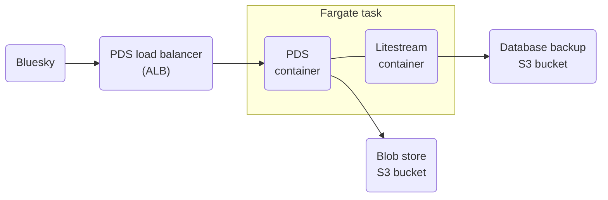

# bluesky-pds-cdk

This repository contains an AWS CDK template for self-hosting a
[Bluesky Personal Data Server (PDS)](https://atproto.com/guides/self-hosting) on AWS Fargate.

## Architecture

## Deploy your PDS

See the [deployment guide](guides/DEPLOY.md) for instructions on how to deploy the Bluesky PDS using this CDK template.

## Security

See [CONTRIBUTING](CONTRIBUTING.md#security-issue-notifications) for more information.

## License

This library is licensed under the MIT-0 License. See the LICENSE file.
