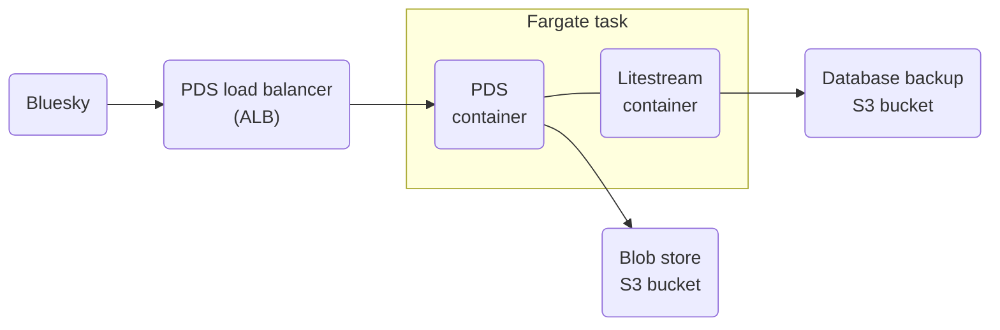

# bluesky-pds-cdk

This repository contains an AWS CDK template for self-hosting a fully containerized, serverless
[Bluesky Personal Data Server (PDS)](https://atproto.com/guides/self-hosting) on AWS.

## Architecture

This architecture was designed with resiliency, observability, and security in mind.
A single [AWS Fargate](https://aws.amazon.com/fargate/) task sits behind a load balancer
that spans two AZs, running in its own VPC.
The load balancer terminates TLS, and redirects HTTP to HTTPS.
[Amazon ECS](https://aws.amazon.com/ecs/) ensures that only one task
is running at a time. In case of an unhealthy task, ECS will terminate the task and
start a new one in either of the two AZs.

The Fargate task runs two containers:
1. The main **PDS container** uses the
[official PDS image](https://github.com/bluesky-social/pds/pkgs/container/pds),
copied into a private [Amazon ECR](https://aws.amazon.com/ecr/) repository.
The PDS uses an [Amazon S3](https://aws.amazon.com/s3/) bucket for its blob store.
It also uses [AWS Secrets Manager](https://aws.amazon.com/secrets-manager/)
to generate and store its admin password and JWT secret key,
and [AWS KMS](https://aws.amazon.com/kms/) for its PLC rotation key.
[Amazon SES](https://aws.amazon.com/ses/) is used to send emails from the PDS.
2. A **sidecar container** that uses [Litestream](https://litestream.io/)
to continuously replicate the PDS on-disk SQLite databases to S3.
On task launch, the sidecar starts before the PDS and restores the database files
from S3 to the local disk (a shared volume with the PDS container).

For monitoring, container logs are sent to [Amazon CloudWatch](https://aws.amazon.com/cloudwatch/).
Alarms are configured in CloudWatch on load balancer metrics.

## Deploy your PDS

See the [deployment guide](guides/DEPLOY.md) for instructions on how to deploy a Bluesky PDS using this CDK template.

Also see the [cost guide](guides/COST.md) to get a rough idea on the cost for self-hosting a PDS using this CDK template,
as well as other options for self-hosting on AWS.

## Security

See [CONTRIBUTING](CONTRIBUTING.md#security-issue-notifications) for more information.

## License

This library is licensed under the MIT-0 License. See the LICENSE file.
